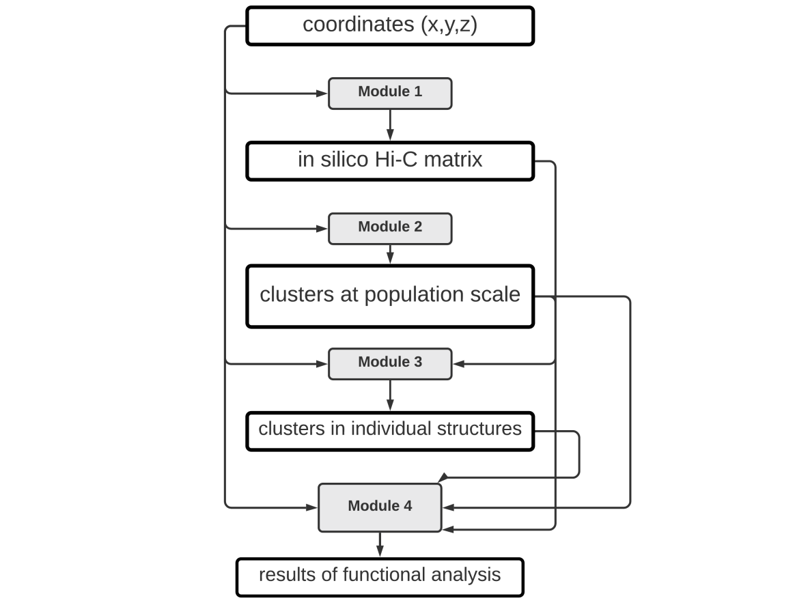

# clusty

## Table of contents
1. [Introduction](#introduction)
2. [Modules](#modules)
3. [Usage](#usage)
    1. [Source Code](#source)
    2. [Docker image](#docker)
4. [ARGS](#args)
5. [Helper files](#helperfiles)
6. [Warnings](#warnings)
7. [Example of analysis](#exampleofanalysis)

### 1. Introduction 

Clusty is a set of computational tool for 3-D genome analysis. Specifically it allows for analysis
of a population of genome structures.

### 2. Modules 

clusty is comprised of 5 modules:

### Module 1

Generates in silico HiC matrix from a population of structures

### Module 2

Detects repeated structural patterns - clusters of beads - on the population scale

### Module 3

detects clusters in single number_of_structures

### Module 4

simple analysis of results from modules 1-3

Modules 1-3 are both in form of Jupyter notebooks, whereas modules 1-3 are provided as python scripts.

### 3. Usage 

According to need / preference clusty can be used in form of source code provided here or as a docker image.

#### 1. source code 

Full enviroment needed for modules can be found in module1_3requirements.txt for modules 1 and 3, or in
module1_4requirements.txt for modules 2 and 4. The python version  used for development and testing is 3.8.10

**Jupyter notebooks:**

For modules 1 - 3 user needs to provide path to ARGS file, contatinins paths and parameters (see ARGS) and run the notebook.
Module 4 notebooks provided here allow to compare two population of structues and may require some further customization by user,
depending on their needs.

**Sciprts**

to run the script used needs to provide path to ARGS file as parameter #1

#### 2. Docker 

A docker image containing all the code and enviroments can be pulled from docker hub (kozaczki/clusty)

Once inside a docker container enviroments can be activates with:

. /venv/module1_3/bin/activate

or

. /venv/module2_4/bin/activate

to run the jupyter notebook:

jupyter-notebook --port=8888 --no-browser --ip=0.0.0.0 --allow-root

#### 3. Docker image on Google Cloud Platform (GCP)

When creating a VM user needs to specify container as :

docker.io/kozaczki/clusty:latest

### 4. ARGS  

In order to run automatically both jupyter notebooks and scripts need to be provided with path to ARGS file.
Detailed description of args:

### 5. Helper files  

Additional files that are required to run clusty modules are:

- primes file
- borders file

### 6. Warnings  

Currently when running module 1 user will get a DeprecationWarning - this can be ignored, as it has no effect on the analysis

### 7. Example of analysis  
